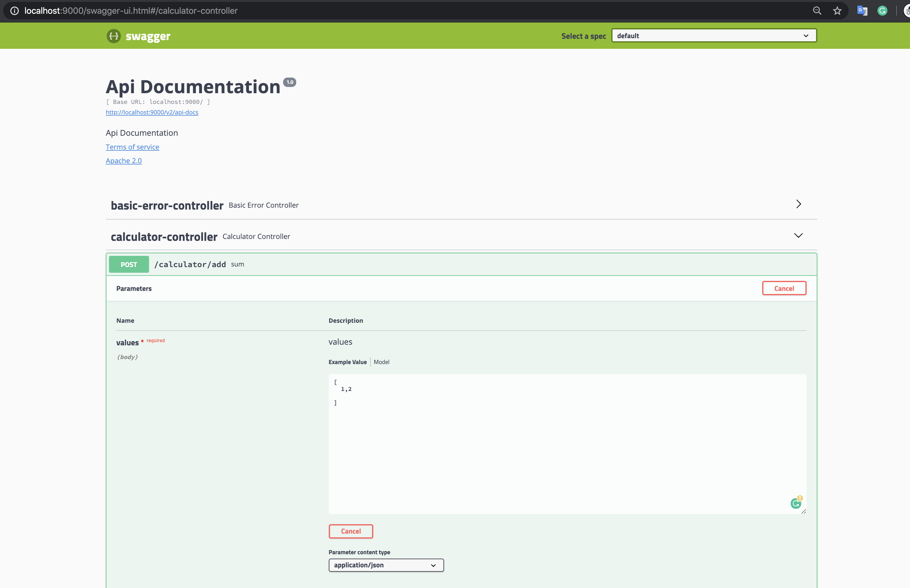
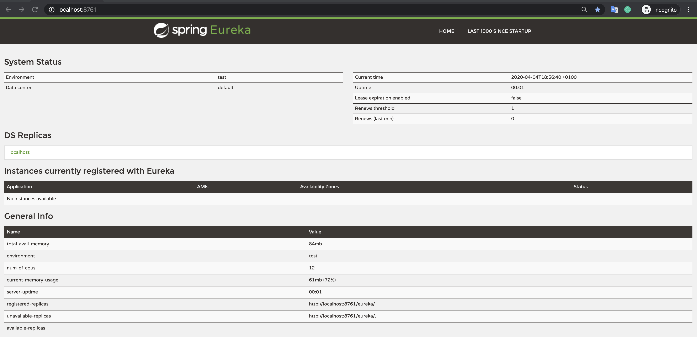
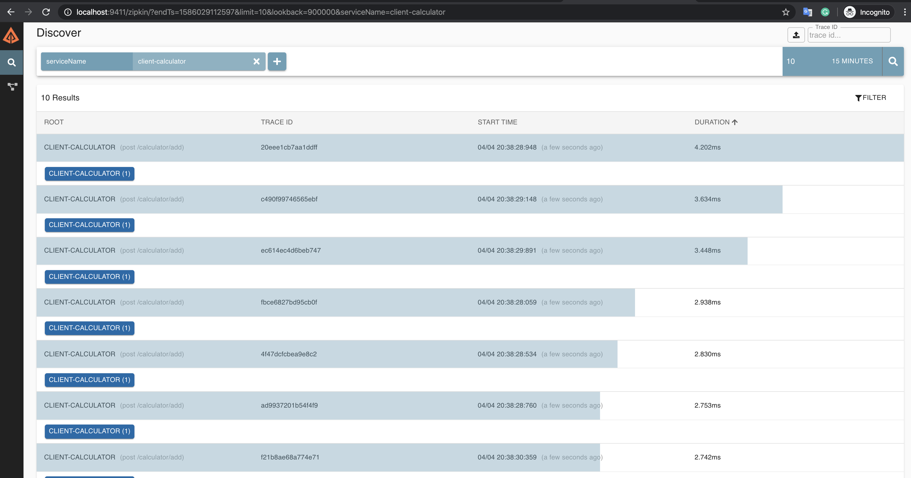

# How to build the application

### Steps
1. Go to the Docker folder `cd Docker/`
2. execute the script `start-project.sh`

The application take around 2 minutes to start all the dependencies. 

## The application will start all the dependencies 
1. **Zipkin**
2. **Eureka-Server**
3. **Calculator-Core-Service**
4. **Calculator-Client**

### Client Swagger 
[http://localhost:9000/swagger-ui.html]()

### Eureka
[http://localhost:8761/]()

### Zipkin
[http://localhost:9411/zipkin/]()

### Calculator Client 

## Stack
1. **Spring-Boot**
2. **Netflix Eureka**
3. **Spring Cache**
4. **Caffeine Cache**
5. **Zipkin**
